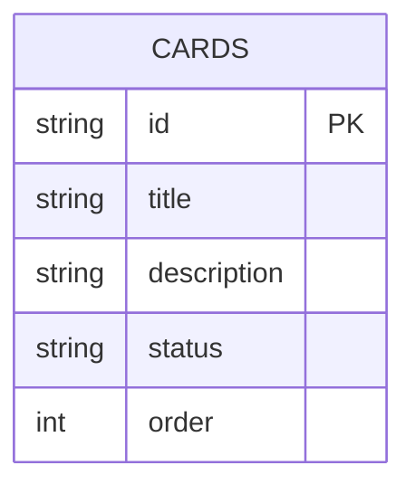

# Kanban Board

React + TypeScript + Vite + FastAPI + SQLite 기반으로 구현한 Kanban Board 애플리케이션입니다.

드래그 앤 드롭으로 카드를 이동할 수 있으며, SQLite를 사용해 데이터가 영구 저장됩니다.

---

## Preview

```txt
To Do | In Progress | Done
```

* 카드 생성
* 카드 수정
* 카드 삭제
* 상태 이동
* SQLite 영구 저장

---

# Tech Stack

## Frontend

* React
* TypeScript
* Vite
* CSS

## Backend

* FastAPI
* SQLAlchemy
* SQLite
* Pydantic
* Uvicorn

---

# Project Structure

```txt
kanban-app/
│
├── backend/
│   ├── main.py
│   ├── database.py
│   ├── models.py
│   ├── schemas.py
│   ├── requirements.txt
│   └── kanban.db
│
└── frontend/
    ├── package.json
    ├── vite.config.ts
    ├── index.html
    └── src/
        ├── main.tsx
        ├── App.tsx
        ├── App.css
        ├── api.ts
        └── types.ts
```

---

# Features

* 카드 CRUD
* Drag & Drop
* REST API
* SQLite 영구 저장
* FastAPI Swagger 문서
* 반응형 레이아웃

---

# ERD



상태값:

```txt
todo
in_progress
done
```

---

# Backend Setup

## 1. 이동

```bash
cd backend
```

## 2. 가상환경 생성

```bash
python -m venv .venv
```

## 3. 가상환경 실행

### macOS / Linux

```bash
source .venv/bin/activate
```

### Windows PowerShell

```powershell
.\.venv\Scripts\Activate.ps1
```

## 4. 패키지 설치

```bash
pip install -r requirements.txt
```

## 5. 서버 실행

```bash
uvicorn main:app --reload --port 8000
```

---

# Frontend Setup

## 1. 이동

```bash
cd frontend
```

## 2. 패키지 설치

```bash
npm install
```

## 3. 개발 서버 실행

```bash
npm run dev
```

---

# Local URLs

## Frontend

```txt
http://localhost:5173
```

## Backend

```txt
http://localhost:8000
```

## Swagger Docs

```txt
http://localhost:8000/docs
```

---

# API

## 카드 조회

```http
GET /cards
```

---

## 카드 생성

```http
POST /cards
Content-Type: application/json

{
  "title": "새 카드",
  "description": "설명",
  "status": "todo"
}
```

---

## 카드 수정

```http
PATCH /cards/{card_id}
Content-Type: application/json

{
  "title": "수정된 제목"
}
```

---

## 카드 삭제

```http
DELETE /cards/{card_id}
```

---

## 카드 이동

```http
POST /cards/{card_id}/move
Content-Type: application/json

{
  "status": "done",
  "order": 0
}
```

---

# SQLite

FastAPI 실행 시 자동으로 SQLite 파일이 생성됩니다.

```txt
backend/kanban.db
```

서버를 재시작해도 데이터가 유지됩니다.

---

# requirements.txt

```txt
fastapi==0.115.6
uvicorn[standard]==0.34.0
pydantic==2.10.4
sqlalchemy==2.0.36
```

---

# Future Improvements

* PostgreSQL 지원
* 사용자 인증
* 멀티 보드
* 컬럼 추가/삭제
* 카드 정렬 개선
* Docker 배포
* JWT 인증
* 실시간 동기화

---

# License

MIT License
